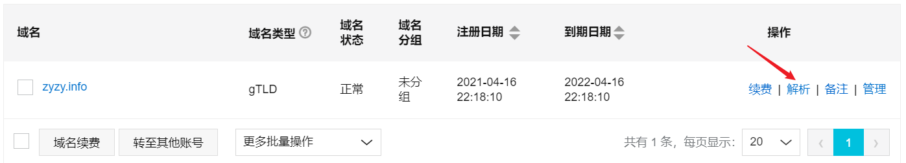
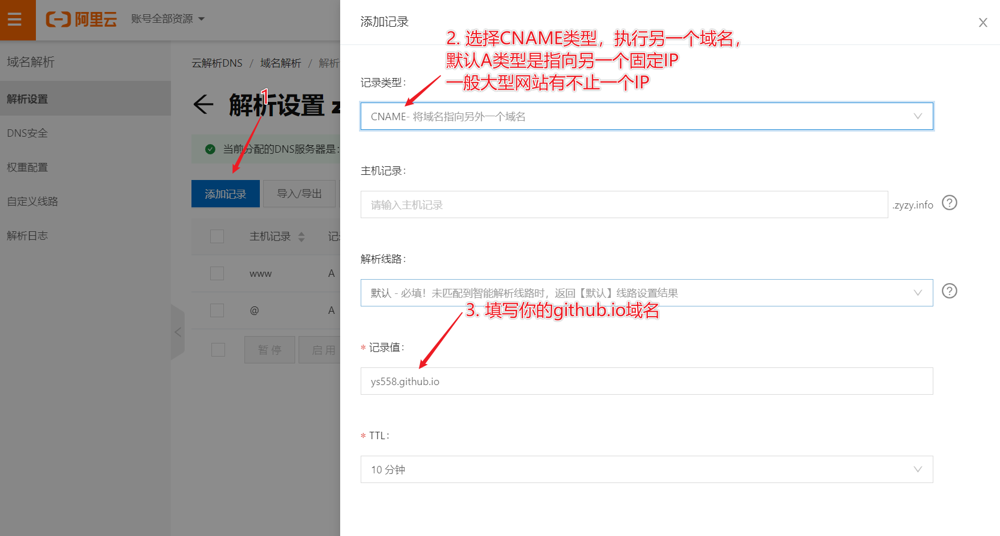
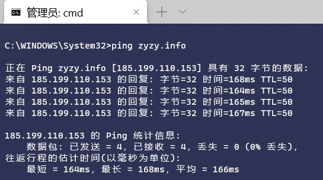
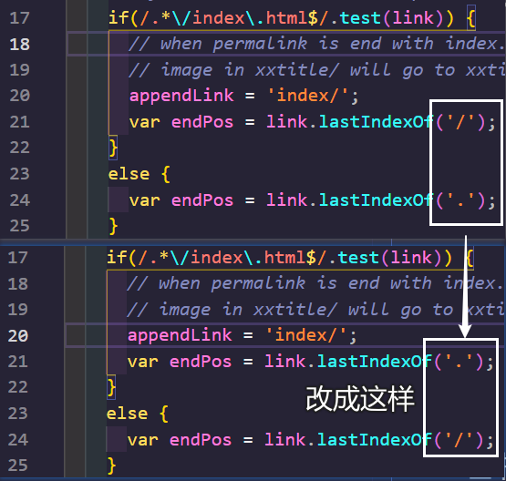

最近想用 `github.io` 建立我的个人博客站点，具体步骤我参考了[知乎上的一篇文章](https://zhuanlan.zhihu.com/p/26625249)，里面写的够清楚了，下面就建站时碰到的坑写的不完全总结，估计以后陆续增加

<!-- more -->

## `ys558.github.io`改为自己的域名

去阿里云申请一个自己的域名后绑定原理的[ys558.github.io](https://ys558.github.io/zyzy.github.io/)域名，步骤：

1. 登陆[阿里云的万网](https://wanwang.aliyun.com/domain/)，挑一个喜欢便宜的域名注册，我的域名 [zyzy.info](https://zyzy.info) 一年只花21元，注册完成后选择个人站点，顺便也就开通了阿里云账号，如其他域名服务商，如申请`.me`结尾的个人网站，应该去[GoDaddy](https://au.godaddy.com/)等
2. 依次进入右上角的 **控制台** => **运维管理** 选项卡下找到 **域名** 标签 => 点击 **解析**，如下：  

=> 点击**添加记录**， 在 **记录值** 处填下`ys558.github.io`，如下，点击确定。这样就把你github.io上的页面绑定了购买的域名下

3. 用`ping` 也可查询到新绑定的域名网址IP：  

4. 按以下命令在自己的github仓库中添加CNAME文件，其中填入购买的域名。或者可以在仓库的settings中设置Custom Domain设置好自己的域名，github会自动添加CNAME文件。
    ```shell
    touch CNAME
    echo 'yucicheung.me'> CNAME
    ```


## 图片显示错误：
1. 需要安装一个图片路径转换的插件，这个插件名字是 `hexo-asset-image`  

    ```shell
    npm i hexo-asset-image --save
    # or
    yarn add hexo-asset-image --save
    ```


2. `_config.yml`文件，修改下述内容，用 `hexo n <博客文章名字>` 生成新博客时，会生成一个对应的文件夹，将图片放入该文件夹引用即可：

    ```json
    post_asset_folder: true
    ```

3. 修改博客目录下`node_modules\hexo-asset-image\index.js` (hexo文件有bug)



## 证书错误，不是私密连接
[cloudfare](https://www.cloudflare.com/zh-cn/)